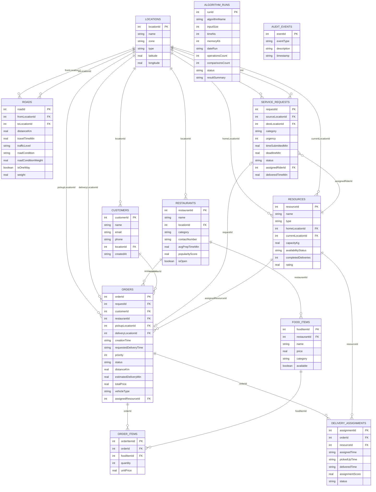

# Entity Relationship Diagram — UG Smart Food Delivery & Dispatch Optimizer

Group 1 — Database Architecture, Data Management & Core Data Structures

**Canonical version.** Matches `db/schema.sql` and `DATA_DICTIONARY.md` exactly (camelCase, matching the existing Java models). Supersedes any earlier snake_case ERD/dictionary draft — do not build against that one.

This diagram renders automatically on GitHub (any `.md` file with a ```mermaid
code block displays as a diagram in the file preview).



## Notes on relationships

- **LOCATIONS** is the central hub — every physical point in the system (campus buildings, hostels, restaurants, customer addresses) is a `locationId` reference into this one table. This keeps distance/routing calculations consistent regardless of what kind of entity is at each point.
- **ROADS** forms the edges of the campus graph (`Graph` data structure in `src/ds`) — two foreign keys into `LOCATIONS` per edge.
- **SERVICE_REQUESTS → ORDERS** is a one-to-one-or-zero relationship: a request becomes an order once accepted, but not every request necessarily results in one (e.g. cancelled/invalid requests).
- **ORDERS → ORDER_ITEMS → FOOD_ITEMS** models the many-to-many between orders and menu items (an order can contain multiple food items, and a food item can appear in many orders) via the `order_items` junction table.
- **ORDERS → DELIVERY_ASSIGNMENTS → RESOURCES** separates *what was ordered* from *who is delivering it and when*, so the delivery lifecycle timestamps (assigned/picked up/delivered) don't clutter the `orders` table itself.
- **ALGORITHM_RUNS** and **AUDIT_EVENTS** are standalone log tables with no foreign keys — they record system behavior (performance benchmarks, event trail) rather than domain entities.
